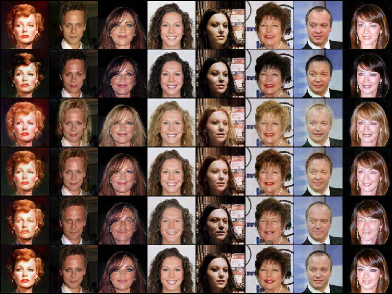

# StarGAN

#### Title
[StarGAN: Unified Generative Adversarial Networks for Multi-Domain Image-to-Image Translation](https://arxiv.org/abs/1711.09020)

#### Abstract
Recent studies have shown remarkable success in image-to-image translation for two domains. However, existing approaches have limited scalability and robustness in handling more than two domains, since different models should be built independently for every pair of image domains. To address this limitation, we propose StarGAN, a novel and scalable approach that can perform image-to-image translations for multiple domains using only a single model. Such a unified model architecture of StarGAN allows simultaneous training of multiple datasets with different domains within a single network. This leads to StarGAN's superior quality of translated images compared to existing models as well as the novel capability of flexibly translating an input image to any desired target domain. We empirically demonstrate the effectiveness of our approach on a facial attribute transfer and a facial expression synthesis tasks.

## Result

    1st row: input
    2nd row: Black_Hair
    3rd row: Blond_Hair
    4th row: Brown_Hair
    5th row: Male
    6th row: Young

* The results are generated by trained network using **celeba** dataset during **16 epochs**.

    1st row: input
    2nd row: angry
    3rd row: contemptuous
    4th row: disgusted
    5th row: fearful
    6th row: happy
    7th row: neutral
    8th row: sad
    9th row: surprised
    
* The results are generated by trained network using **rafd** dataset during **140 epochs**.

## Train
    $ python main.py --mode train --scope [scope name]

* Set **[scope name]** uniquely.

## Test
    $ python main.py --mode test --scope [scope name]

* Set **[scope name]** to test using scoped network
* In **result** folder, generated images are saved under the **images** subfolder.
* In addition, **index.html** is created to illustrate the generated images.  

## Tensorboard
    $ tensorboard --logdir log/[scope] --port [(optional) 4 digit port number]

Then, click **http://localhost:6006**

* You can change **[(optional) 4 digit port number]**
* 4 digit port number = 6006 (default)
